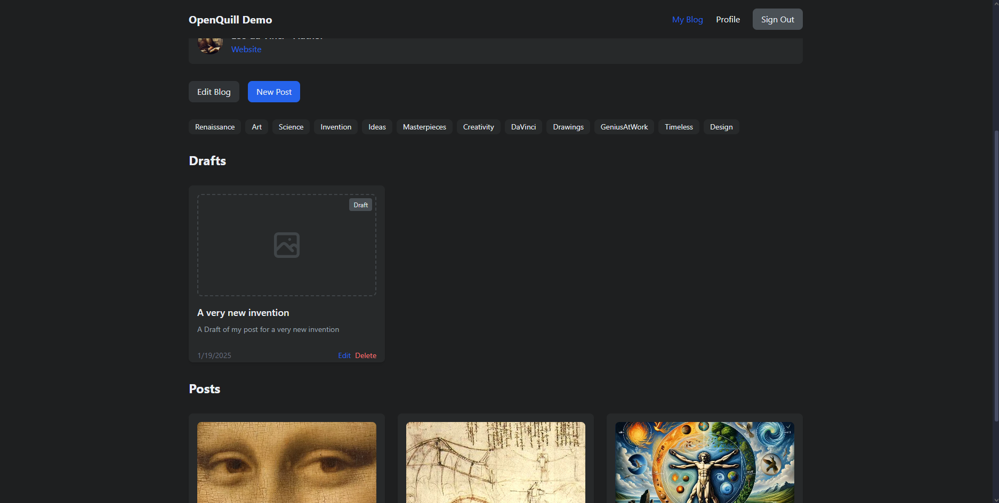

# OpenQuill Gallery

Visual tour of OpenQuill's key features and interfaces.

## 🏠 Home Experience

*Landing page showcasing recent posts across all blogs*

*Home feed with multiple blog posts and author information*

## 📝 Blog Management

*Individual blog homepage with post collection*

*Blog view with tag filtering and post previews*

### Blog Owner View

*Enhanced controls for blog owners*

*Post management interface for blog owners*

*Editor interface with post creation tools*

## 📖 Post Experience

*Clean reading experience for blog posts*

*Post layout with images and rich content*

### Post Editor

*Markdown editor with live preview*

## 👤 User Experience

*User profile page with customization options*

*Profile management and settings*

## ⚙️ Administration

*Administrative controls and platform management*

## 🆕 New User Onboarding

*Initial welcome experience*

*Blog setup guidance*

*Profile customization walkthrough*

*Completion of onboarding process*